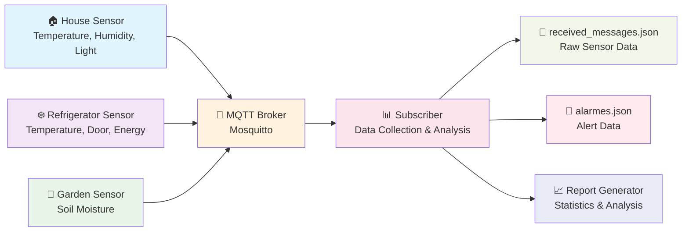

# IoT Sensor Simulation Project
**Simulação Sensores de Casa, Frigorifico e Jardim**

A Python-based IoT sensor simulation system that generates realistic sensor data and monitors environmental conditions across three different environments: refrigerator, house, and garden.

## 📋 Project Overview

This project simulates IoT sensors using Python scripts with MQTT communication through a Mosquitto broker. The system generates sensor data, stores it in JSON format, and provides real-time monitoring with alarm notifications based on predefined thresholds.

### 🏠 Monitored Environments

1. **Refrigerator (Frigorifico)** - Food preservation monitoring
2. **House (Casa)** - Air conditioning and lighting management  
3. **Garden (Jardim)** - Irrigation system control

## 🛠 System Architecture



## 📊 Sensor Data

### Refrigerator Sensors
- **Temperature**: 0-8°C (optimal food preservation range)
- **Door Status**: Open/Closed
- **Energy Consumption**: 200-350 kWh

### House Sensors  
- **Temperature**: 0-50°C (room temperature monitoring)
- **Humidity**: 15-100%
- **Light Status**: On/Off

### Garden Sensors
- **Soil Moisture**: 30-100% (irrigation control)

## 🚨 Alert System

The system generates alerts based on the following thresholds:

### Refrigerator Alerts
- **HIGH (ALTO)**: Temperature 3.1-3.9°C
- **CRITICAL (CRITICO)**: Temperature ≥ 5°C  
- **ALERT (ALERTA)**: Door left open

### House Alerts
- **COLD (FRIO)**: Temperature < 23°C
- **HOT (CALOR)**: Temperature > 25°C
- **ALERT (ALERTA)**: Lights left on

### Garden Alerts
- **HIGH (ALTA)**: Soil moisture ≤ 40%
- **ALERT (ALERTA)**: Soil moisture ≤ 60%

## 🚀 Installation & Setup

### Prerequisites
- Python 3.7+
- Mosquitto MQTT Broker
- Required Python packages:
  ```bash
  pip install paho-mqtt
  ```

### MQTT Broker Configuration
1. Install Mosquitto:
   ```bash
   # Ubuntu/Debian
   sudo apt-get install mosquitto mosquitto-clients
   
   # macOS
   brew install mosquitto
   
   # Windows
   # Download from https://mosquitto.org/download/
   ```

2. Start the broker:
   ```bash
   mosquitto -v
   ```

### Project Setup
1. Clone or download the project files
2. Update the MQTT broker IP address in the Python scripts:
   ```python
   client.connect("192.168.68.123", 1883, 60)  # Update with your broker IP
   ```

## 💻 Usage

### 1. Start the Sensor Simulators
```bash
python simulador_sensores_v1.py
```
This script will:
- Generate realistic sensor data every 3 seconds
- Publish data to MQTT topics:
  - `iot/sensores/frigorifico`
  - `iot/sensores/casa` 
  - `iot/sensores/jardim`

### 2. Start the Data Subscriber
```bash
python subscribe_v1.py
```
This script will:
- Subscribe to all MQTT topics
- Monitor sensor data in real-time
- Generate alerts when thresholds are exceeded
- Save data to JSON files

### 3. Generate Reports
```bash
python relatorio_v1.py
```
This script will:
- Analyze collected sensor data
- Generate statistical reports
- Display alarm summaries

## 📁 File Structure

```
├── simulador_sensores_v1.py    # Sensor data simulation
├── subscribe_v1.py             # Data collection & monitoring
├── relatorio_v1.py             # Report generation
├── received_messages.json      # Raw sensor data storage
├── alarmes.json               # Alert/alarm storage
└── README.md                  # This file
```

## 📈 Sample Output

### Sensor Data (JSON)
```json
{
  "iot/sensores/frigorifico": [
    {
      "topic": "iot/sensores/frigorifico",
      "payload": {
        "Device": "Frigorifico",
        "timestamp": "2025-02-02T13:02:57.511331+00:00",
        "temperatura": 5.84,
        "porta_aberta": true,
        "consumo_energia": 217.35
      }
    }
  ]
}
```

### Alert Example
```
ALARME CRITICO: - Temperatura do Frigorifico é 7.21°C, intervenção urgente! acima dos 5°C!
ALERTA: - A porta do Frigorifico ficou aberta, fechar a porta!
```

### Generated Reports
```
============== RELATÓRIO DO DEVICE FRIGORIFICO ================

A média da temperatura do Frigorifico é: 3.85°C
Consumo total é de 4270.43Kwh e a média do consumo é 266.9Kwh

ALARMES CRITICOS:
O numero Total de alarmes Criticos foram: 4
Timestamp: 2025-02-01T21:47:24.735810+00:00, Temperatura: 7.21
```

## 🧪 Testing

The project includes validation tests for:
- Correct sensor value generation
- Error handling for invalid data
- MQTT communication reliability
- Alert threshold accuracy

Run tests with:
```bash
python teste_simulador_sensores_certos.py  # Valid data tests
python teste_simulador_sensores_erros.py   # Error condition tests
```

## 🔧 Configuration

### MQTT Topics
- **Refrigerator**: `iot/sensores/frigorifico`
- **House**: `iot/sensores/casa`  
- **Garden**: `iot/sensores/jardim`

### Customizable Thresholds
Edit the threshold values in `subscribe_v1.py` to adjust alert sensitivity:
```python
# Refrigerator temperature thresholds
if temperatura > 3 and temperatura <= 3.9:  # HIGH alert
elif temperatura >= 5:                      # CRITICAL alert
```

## 📚 Dependencies

### Standard Libraries
- `json` - JSON data handling
- `random` - Sensor value generation  
- `time` - Timing control
- `datetime` - Timestamp generation

### External Libraries
- `paho-mqtt` - MQTT communication

## 🤝 Contributing

This project was developed as part of an Introduction to Programming course. Contributions and improvements are welcome!

- 📄 License

Educational project - Instituto Superior de Tecnologias Avançadas de Lisboa (ISTEC)
---

For questions or issues, please refer to the project documentation or contact the developer.
